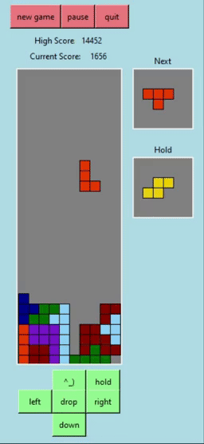

# Tetris game 



This project was created with intentions to learn more about advanced Object-Oriented Programming principles: 
- Dynamic dispatch
- Inheritance
- Composition
- Class Hierarchy

`tetris_base` is implemented with minimal feature to demonstrate effects of **Class Hierarchy** and **Inheritance**.

`tetris_enhanced` contains two subclass: `My_Class` and `My_Challenge_Class` where `My_Challenge_Class` < `My_Class`. This is done to show the seperation between a subclass and its "ancestor" as well as their union via **dynamic dispatch**.

`tetris_graphic` contains all the necessary graphic in order to run the game

`tetris_runner` is the bridge to run 3 different tetris game, from 3 different classes.

In order to run the game, type the command below in the terminal, substituting _tetris_type_ with either `original`, `enhanced`, or `challenge`
```
 ruby tetris_runner tetris_type
```

Control:
  w             up
 asd  or  left down right

 u - rotate 180
 e or / - hold block
 q - quit game
 p - pause
 r or n - new game